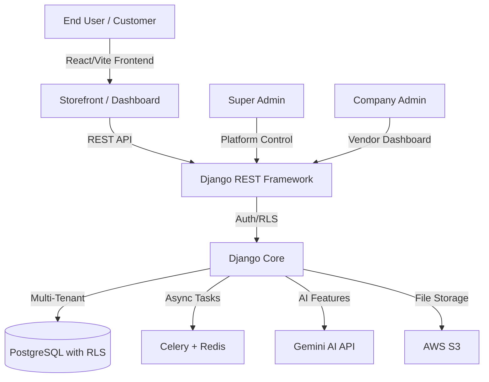
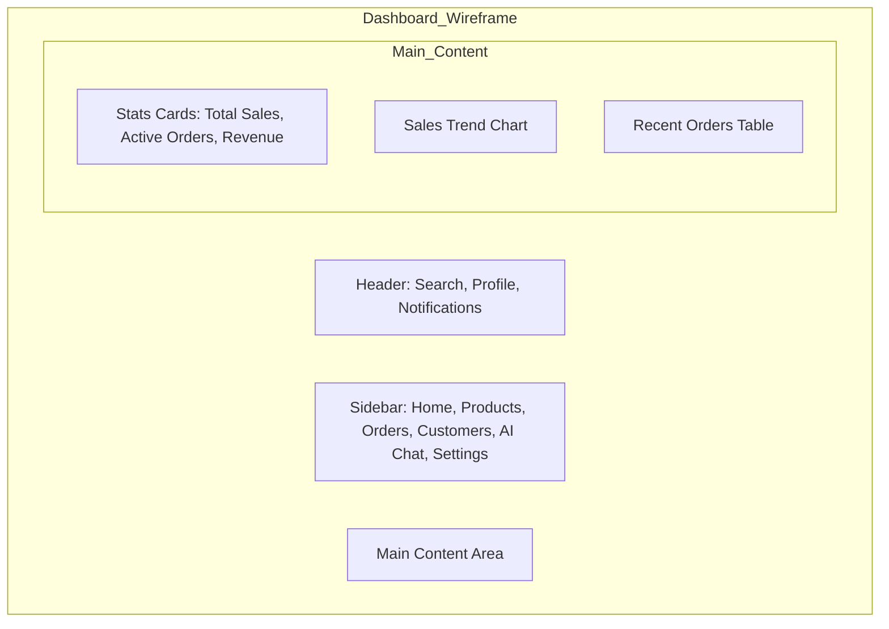

# AlgoFlow: The Next-Generation Multi-Vendor SaaS Platform


## Overview
AlgoFlow is a robust, production-ready multi-vendor e-commerce SaaS platform designed to empower businesses to launch and manage their own digital marketplaces with unparalleled ease, security, and scalability. Built with a modern, decoupled architecture, AlgoFlow provides complete tenant isolation, advanced administrative controls, and integrated AI capabilities, making it an ideal solution for businesses seeking to establish or expand their e-commerce ecosystems.

This repository contains the full source code for AlgoFlow, encompassing both the backend API and the frontend user interfaces. It is structured to facilitate rapid deployment, easy customization, and seamless integration of advanced features.

## Key Features
AlgoFlow offers a comprehensive suite of features tailored for various user roles, ensuring a seamless and efficient experience across the platform.

### For Super Admins (Platform Owners)
- **Company Creation & Management**: Effortlessly onboard, activate, and deactivate vendor companies.
- **Platform-wide Analytics**: Monitor overall platform performance, including total products, orders, and revenue.
- **Subscription Management**: Configure and manage tiered subscription plans (e.g., Free, Starter, Pro, Enterprise).
- **User Management**: Centralized control over all user accounts across all tenants.

### For Company Admins (Vendors)
- **Dedicated Dashboard**: Access company-specific analytics, including sales, orders, and product performance.
- **Product Management**: Full CRUD (Create, Read, Update, Delete) capabilities for their product catalog.
- **Order Management**: View and update orders specific to their company.
- **Customer & Staff Management**: Manage customers and staff members associated with their store.
- **Chat Support**: Engage with customer inquiries directly through an integrated chat system.
- **Company Settings**: Customize storefront branding, contact information, and other settings.

### For Customers (End Users)
- **Intuitive Storefronts**: Browse products, add to cart, and manage wishlists.
- **Order Placement & Tracking**: Seamless ordering process and real-time order history.
- **AI-Powered Chat**: Instant support and product recommendations via integrated AI (Gemini).
- **Product Reviews**: Ability to write and view product reviews.

## Technical Architecture
AlgoFlow is engineered with a robust and modern technology stack, ensuring high performance, scalability, and maintainability. The decoupled architecture separates concerns, allowing for independent development and scaling of services.

### Backend
- **Django (Python)**: A high-level Python web framework for rapid development and clean design, forming the core of AlgoFlow's API management.
- **Django REST Framework (DRF)**: Used for building powerful and flexible APIs, providing token-based authentication and permission handling for various user roles.
- **Celery & Redis**: For asynchronous task processing, enabling features like AI responses and background jobs without impacting user experience. Redis serves as the message broker and result backend.

### Frontend
- **React (Vite)**: A fast and efficient JavaScript library for building user interfaces, coupled with Vite for a lightning-fast development experience.
- **TypeScript**: Enhances code quality and maintainability through static type checking.
- **Tailwind CSS**: A utility-first CSS framework for rapidly building custom designs.

### Database & Infrastructure
- **PostgreSQL**: A powerful, open-source object-relational database system known for its reliability, feature robustness, and performance. AlgoFlow utilizes PostgreSQL with Row-Level Security (RLS) for stringent data isolation between tenants.
- **AWS S3**: Used for secure and scalable file uploads and storage.
- **Gemini AI**: Integrated for advanced functionalities such as AI-powered customer support and personalized product recommendations.

### System Diagram


## Wireframe Representation: Multi-Vendor Dashboard
To illustrate the user experience for Company Admins, here's a high-level wireframe of the multi-vendor dashboard:




## Setup Guide
Follow these steps to get AlgoFlow up and running on your local machine for development and testing purposes.

### Prerequisites
- Python 3.9+
- Node.js 18+
- Docker & Docker Compose (recommended for local development)
- PostgreSQL (if not using Docker)

### 1. Clone the Repository
```bash
git clone https://github.com/prabinKh/algoflowev4.git
cd algoflowev4
```

### 2. Backend Setup
Navigate to the `backend` directory and install Python dependencies:
```bash
cd backend
pip install -r requirements.txt
```

Configure your `.env` file (create one from `.env.example` if it exists) with your database settings, AWS S3 credentials, and Gemini AI API key.

Run database migrations:
```bash
python manage.py migrate
```

Create a superuser:
```bash
python manage.py createsuperuser
```

Start the Django development server:
```bash
python manage.py runserver
```

### 3. Frontend Setup
Open a new terminal, navigate to the project root (`algoflowev4`), and install Node.js dependencies:
```bash
pnpm install # or npm install / yarn install
```

Start the React development server:
```bash
pnpm dev # or npm run dev / yarn dev
```

### 4. Celery & Redis (Optional, for full functionality)
For asynchronous tasks and AI features, you'll need Redis and Celery. If using Docker Compose, these will be handled automatically. Otherwise, install Redis and run Celery:

Start Redis server:
```bash
redis-server
```

In a new terminal, start Celery worker:
```bash
celery -A fixitall_backend worker -l info
```

